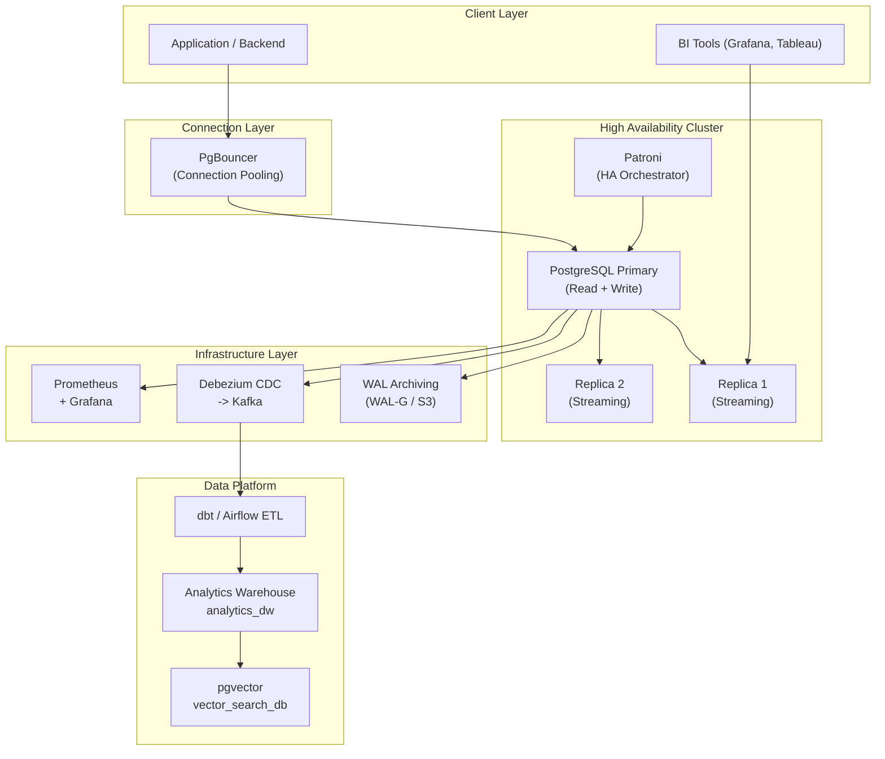
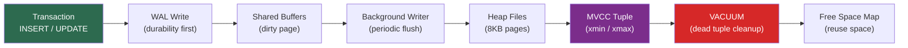
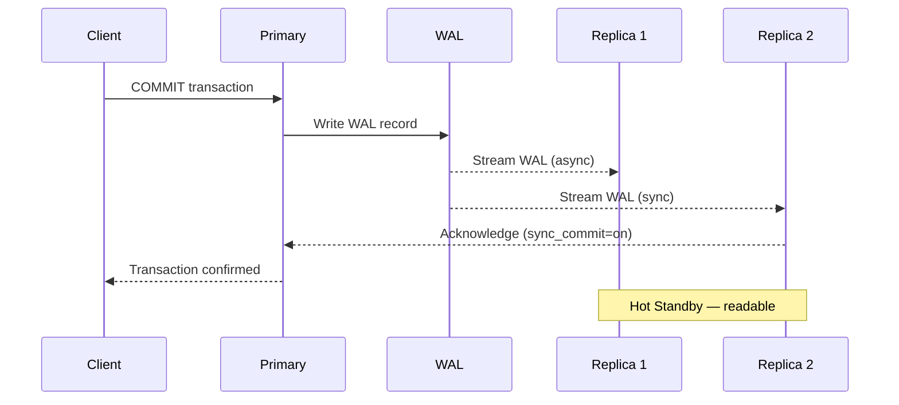

# diagrams/ — Architecture Diagrams
# diagrams/ — Sơ Đồ Kiến Trúc

This directory contains architecture diagrams for the PostgreSQL Infrastructure & Database Engineering Roadmap.

---

## Overall System Architecture

---

## MVCC & Storage Internals

---

## Replication Architecture

---

## 9-Stage Learning Path

```mermaid
graph LR
    S0["Stage 0\nData Modeling"] --> S1["Stage 1\nFundamentals"]
    S1 --> S2["Stage 2\nBackend Integration"]
    S2 --> S3["Stage 3\nInternals & MVCC"]
    S3 --> S4["Stage 4\nProduction Ops"]
    S4 --> S5["Stage 5\nDistributed Systems"]
    S5 --> S6["Stage 6\nWarehousing & ETL"]
    S6 --> S7["Stage 7\nObservability & SRE"]
    S7 --> S8["Stage 8\nAI & Vector Search"]

    style S0 fill:#52b788,color:#fff
    style S1 fill:#52b788,color:#fff
    style S2 fill:#f4d35e
    style S3 fill:#e63946,color:#fff
    style S4 fill:#7b2d8b,color:#fff
    style S5 fill:#1d3557,color:#fff
    style S6 fill:#795548,color:#fff
    style S7 fill:#1565c0,color:#fff
    style S8 fill:#e65100,color:#fff
```

---

## Files in This Directory

| File | Description |
|------|-------------|
| `README.md` | Architecture diagrams (Mermaid) |

> **Note:** Diagrams render automatically on GitHub. To view locally, use a Mermaid-compatible editor (e.g., VS Code with Mermaid Preview extension).