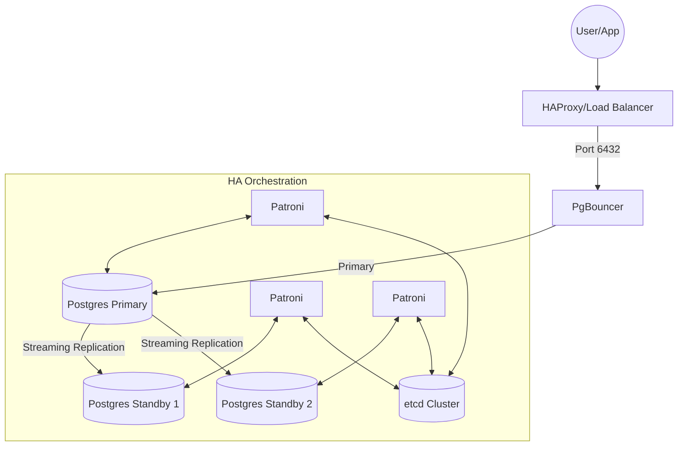

# Architecture Diagrams Requirements
## Yêu cầu Kỹ thuật Sơ đồ Kiến trúc

### 🎯 Objective / Mục tiêu
- Visualize complex PostgreSQL architectures (HA, Distributed, CDC) using Mermaid.js.
- Trực quan hóa kiến trúc PostgreSQL phức tạp bằng Mermaid.js.

---

### 💻 Sample: High Availability Cluster Architecture
File: `ha_cluster.mermaid`

### 📋 Recommended Tools
- **Excalidraw**: For hand-drawn style architecture.
- **Mermaid.js**: For version-controlled diagrams in Markdown.
- **draw.io**: For detailed network diagrams.
